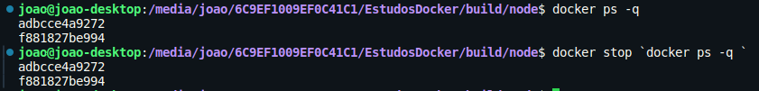

# COMANDOS

- [Image](#Image)
- [Build](#Build)
- [Containers](#Containers)
- [Exec](#Exec)
- [Network](#Network)
- [Volumes](#Volumes)
- [Logs](#Logs)

## Image

`docker image`  - ver os comandos relacionados a ‘images’

`docker image ls`  - ver as imagens que temos

`docker image inspect nginx:1.21.6-alpine`  - iremos ver o conteúdo da imagem passada

`docker images`  - ver as images que estão rodando

`docker pull <image:tag>` - baixar uma imagem do Docker Hub

`docker image history <image:tag>`   - Ver como a imagem foi feita

## Build

`docker build —build-arg VERSION=2.0.0 nodeapp .`  - Contruimos uma imagem com o nome “nodeapp” com base no Dockerfile do diretório atual/. com um ARG VERSION=2.0.0 

`docker build https://github.com/docker/rootfs.git#container:docker`  - Exemplo de uso da construção duma imagem apartir de um arquivo localizado no github #branch:subdiretório

## Container

`docker container` - ver os comandos para containers

`docker run nginx:1.21.6-alpine` - ‘run’ iniciou um container com a imagem do ‘nginx…’

`docker ps` - ve os containers que estão rodando

`docker ps -a` - além de ver o que estão rodando ve os que estão parados

`docker run -d -p 8080:80 nginx:1.21.6-alpine`  - dessa forma estou configurando que o container cubirá em modo background (-d), e a porta que rodará será 8080 através de ‘-p’, ou seja, a pora 8080 do host estará ouvindo para passar para a porta 80 do meu container.

`docker run -d -e PORT=2000 nodeapp` - PORT é uma variavel de ambiente com o valor 2000

`docker stop <id_container>` - parar um container

`docker container top <id_container>` - verifica os processos que o container está executando

`docker ps -q` - retorna os ids dos containers que estão rodando

Parar todos os containers que estão rodando:

## Exec

`docker exec —help`

- Digitar comando dentro do container:

`docker exec <id_container> ls /` - faz o comando ls na pasta ‘/’ do container passado

`docker exec -it <id_container> /bin/bash`  - “menu interativo (-it), abre o bash dentro do container. Caso de erro no bash utileze o `/bin/sh`

## Network

`docker network`

`docker network ls`

`docker network create --help`

`docker network create demo` - cria a rede ‘demo’

## Volumes

`docker volume`

`docker volume create --help`

`docker volume create` - Por padrão cria-se com método Volume (ver módulo de volumes), um diretório aleatório

## Extras

`docker logs <id_container>`  - ve os logs do container